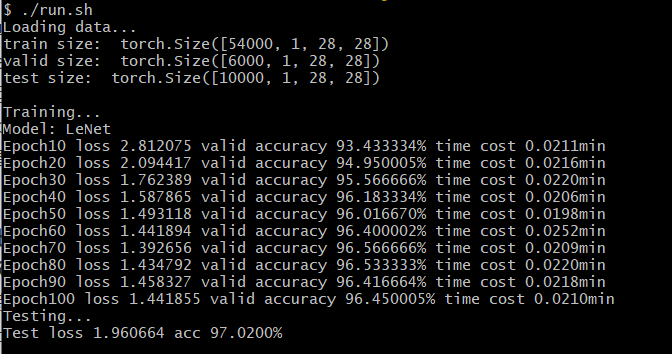

# Intro

本次项目为CNN图像识别任务。

项目使用MNIST数据集，将其划分后得到54000条训练数据、6000条验证数据和10000条测试数据，每条数据为28\*28的图片像素数据，标签为0到9的数字。

本次项目实现了5个CNN网络模型用于图像识别任务，实现过程皆通过参考论文原文，基本保持和原论文网络结构一致。5个模型依次是：LeNet[[1]](https://axon.cs.byu.edu/~martinez/classes/678/Papers/Convolution_nets.pdf)、AlexNet[[2]](https://proceedings.neurips.cc/paper_files/paper/2012/file/c399862d3b9d6b76c8436e924a68c45b-Paper.pdf)、ResNet34[[3]](https://arxiv.org/abs/1512.03385)、VGG-16[[4]](https://arxiv.org/abs/1409.1556)、MobileNet V2[[5]](https://arxiv.org/abs/1801.04381).

* LeNet是较早提出的较简单的CNN网络模型，使用卷积层作为特征提取层，其结构也为后来的CNN模型奠定了基调。

* AlexNet是首个提出的CNN大型网络模型，当时使用了两块GPU训练，其参数量放在现在也是很庞大的。

* ResNet是针对深层网络退化问题提出的，深层网络的优化并不容易，导致深层网络的结果往往会比浅层网络更差。ResNet通过引入shortcut结构提升了网络的可优化性，从而让深层网络的复杂结构有了用武之地。由于GPU显存受限以及训练时间过长问题，本次项目测试的是ResNet34版本。
* VGG-16是著名的CNN大模型，其参数量是项目中最大的一个模型，导致其训练起来实在过于缓慢，不得已只能跳过其训练。
* MobileNet V2是2017年提出的CNN模型，该模型集合了MobileNet V1的深度可分离卷积成果和ResNet的shortcut成果，最终得到了一个轻量级的深层模型，其效果和其他大模型(如VGG、ResNet)相差不多。本次项目实现了ResNet50结构的MobileNet V2模型，得到了和ResNet34差不多的结果。

# Run

代码运行脚本可参照[run.sh](run.sh)：

```shell
python codes/main.py --model LeNet --lr 2e-4 --batch_size 512 --optimizer Adam --device cuda --epoch 100
```

在run.sh同级目录下运行脚本即可复现上面LeNet的实验结果，如图：



除了上述参数外，还有其他可选参数：

* reg: 正则项系数
* dropout: dropout概率，只在两个线性层多的网络有用：AlexNet、VGG-16

另外，可选的--model有：LeNet, AlexNet, ResNet, VGG, MobileNet.
