# 当代人工智能 project 3

# 1. 摘要

本次项目为CNN图像识别任务。

项目使用MNIST数据集，将其划分后得到54000条训练数据、6000条验证数据和10000条测试数据，每条数据为28\*28的图片像素数据，标签为0到9的数字。

本次项目实现了5个CNN网络模型用于图像识别任务，实现过程皆通过参考论文原文，基本保持和原论文网络结构一致。5个模型依次是：LeNet[[1]](https://axon.cs.byu.edu/~martinez/classes/678/Papers/Convolution_nets.pdf)、AlexNet[[2]](https://proceedings.neurips.cc/paper_files/paper/2012/file/c399862d3b9d6b76c8436e924a68c45b-Paper.pdf)、ResNet34[[3]](https://arxiv.org/abs/1512.03385)、VGG-16[[4]](https://arxiv.org/abs/1409.1556)、MobileNet V2[[5]](https://arxiv.org/abs/1801.04381).

* LeNet是较早提出的较简单的CNN网络模型，使用卷积层作为特征提取层，其结构也为后来的CNN模型奠定了基调。

* AlexNet是首个提出的CNN大型网络模型，当时使用了两块GPU训练，其参数量放在现在也是很庞大的。

* ResNet是针对深层网络退化问题提出的，深层网络的优化并不容易，导致深层网络的结果往往会比浅层网络更差。ResNet通过引入shortcut结构提升了网络的可优化性，从而让深层网络的复杂结构有了用武之地。由于GPU显存受限以及训练时间过长问题，本次项目测试的是ResNet34版本。
* VGG-16是著名的CNN大模型，其参数量是项目中最大的一个模型，导致其训练起来实在过于缓慢，不得已只能跳过其训练。
* MobileNet V2是2017年提出的CNN模型，该模型集合了MobileNet V1的深度可分离卷积成果和ResNet的shortcut成果，最终得到了一个轻量级的深层模型，其效果和其他大模型(如VGG、ResNet)相差不多。本次项目实现了ResNet50结构的MobileNet V2模型，得到了和ResNet34差不多的结果。

# 2. 数据背景及处理

本次项目使用的数据集为视觉领域经典的MNIST数据集，该数据集包含0到9的手写数字图片数据集。数据集来源：[http://yann.lecun.com/exdb/mnist/](http://yann.lecun.com/exdb/mnist/)

下载后得到4个文件：

* train-images-idx3-ubyte.gz: 训练图片数据
* train-labels-idx1-ubyte.gz: 训练标签数据
* t10k-images-idx3-ubyte.gz: 测试图片数据
* t10k-labels-idx1-ubyte.gz: 测试标签数据

为方便访问，将上面四个文件依次改名为：train_data, train_labels, test_data, test_labels，数据文件位于[dataset](../codes/dataset)文件夹。由于字节数据的特殊性，在[utils](../codes/utils)文件夹内的[loadData.py](../codes/utils/loadData.py)中实现了数据读取的相关组件，其中包含idx1和idx3的字节文件读取，以及对于整个训练任务的数据读取函数loadData()。

loadData()函数以数据路径、验证集比例、批大小(batch_size)为参数，返回3个DataLoader，分别为训练数据、验证数据、测试数据。由于原本的数据集没有验证集，因此从训练集中拿出1/10作为验证集。最终，数据集的大小为：

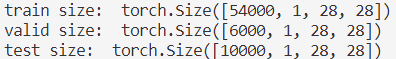

# 3. 模型构建

## (1) LeNet

LeNet模型实现代码位于[LeNet.py](../codes/models/LeNet.py)，实现过程参考论文[[1]](https://axon.cs.byu.edu/~martinez/classes/678/Papers/Convolution_nets.pdf)中的以下图片：

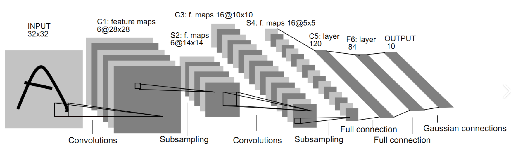

LeNet是个较为简单的卷积网络模型，提出时间也较早，但却是一个十分经典的卷积神经网络结构。

整个模型分为特征提取层和全连接层两部分。特征提取层包含两层卷积和两层最大池化，最后得到5\*5\*16的输出，展平后输入全连接层，最终得到输出，激活函数使用Tanh()函数。代码实现如下：

```python
class LeNet(nn.Module):
    def __init__ (self, dropout_p=0, num_classes=10):
        super(LeNet, self).__init__()
        self.feature = nn.Sequential(
            nn.Conv2d(1, 6, 5, 1),
            nn.AvgPool2d(2, 2),
            nn.Conv2d(6, 16, 5, 1),
            nn.AvgPool2d(2, 2),
        )
        self.fc = nn.Sequential(
            nn.Flatten(),
            nn.Linear(400, 120),
            nn.Linear(120, 84),
            nn.Tanh(),
            nn.Linear(84, num_classes),
        )
        
    def forward(self, x):
        x = self.feature(x)
        x = self.fc(x)
        return x
```

原论文中是有三个卷积层的，但是最后一个卷积层卷积核大小等于feature map的大小，因此等价于全连接层，就直接使用全连接层实现了。

由于当时算力资源的限制，该模型无论是卷积核的层数、卷积核的数量还是全连接层神经元的个数，在如今看来都是非常少的。但是该模型为卷积神经网络解决图像识别问题提供了思路：用卷积提取信息、用池化来减少特征数量、用全连接来提取特征并预测。

## (2) AlexNet

AlexNet模型实现代码位于[AlexNet.py](../codes/models/AlexNet.py)，实现过程参考论文[[2]](https://proceedings.neurips.cc/paper_files/paper/2012/file/c399862d3b9d6b76c8436e924a68c45b-Paper.pdf)中的以下图片：

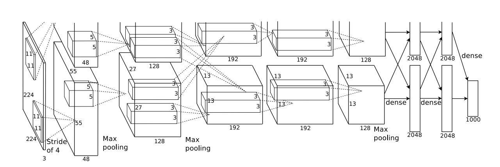

AlexNet是一个非常庞大的模型，其作者当时训练时将模型分为两部分来训练。

整个模型依旧是分为特征提取层和全连接层，输入为c\*224\*224的图片，c为图片颜色通道数。

特征提取层又分为两种基本层：conv+ReLU(卷积+激活)以及maxpool(最大池化)。卷积层的层数和卷积核的数量较LeNet有了显著提升。

后面的线性层隐含层维度为4096，由于模型体量太大了，因此使用dropout提升模型泛化能力。最终代码实现如下：

```python
class AlexNet(nn.Module):
    def __init__(self, dropout_p=0.5, num_classes=10):
        super(AlexNet, self).__init__()
        self.features = nn.Sequential(
            nn.Conv2d(1, 96, 11, 4, 2),
            nn.ReLU(inplace=True),
            nn.MaxPool2d(3, 2),
            nn.Conv2d(96, 256, 5, 1, 2),
            nn.ReLU(inplace=True),
            nn.MaxPool2d(3, 2),
            nn.Conv2d(256, 384, 3, 1, 1),
            nn.ReLU(inplace=True),
            nn.Conv2d(384, 384, 3, 1, 1),
            nn.ReLU(inplace=True),
            nn.Conv2d(384, 256, 3, 1, 1),
            nn.ReLU(inplace=True),
            nn.MaxPool2d(3, 2),
        )
        self.fc = nn.Sequential(
            nn.Flatten(),
            nn.Dropout(dropout_p),
            nn.Linear(256*6*6, 2048),
            nn.ReLU(inplace=True),
            nn.Dropout(dropout_p),
            nn.Linear(2048, 2048),
            nn.ReLU(inplace=True),
            nn.Linear(2048, num_classes),
        )
        
    def forward(self, x):
        x = self.features(x)
        x = self.fc(x)
        return x
```

AlexNet最初是用于1000个类别的图像分类任务，因此模型复杂度很高，这也为深层卷积神经网络模型开了先河。随着算力水平的提升，如今使用的基本都是深层的卷积神经网络。

## (3) ResNet

ResNet模型实现代码位于[ResNet.py](../codes/models/ResNet.py)，实现过程参考论文[[3]](https://arxiv.org/abs/1512.03385)中的以下图片：

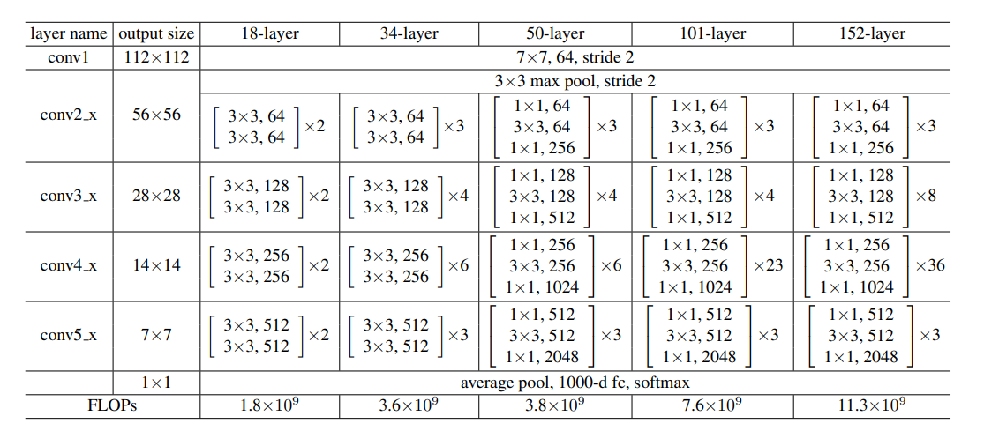

ResNet的实现较为复杂，下面将分多个板块介绍。

* **基本模块: conv_bn_relu**

ResNet中的卷积层有一个特定的基本模块，即卷积层+标准化层+激活层，其中激活层可能会没有。为方便构建模型，创建了conv_bn_relu类，实现该结构：

```python
class conv_bn_relu(nn.Module):
    def __init__(self, in_channels, out_channels, kernel_size, stride, padding=1, bias=False, activation=True):
        super(conv_bn_relu, self).__init__()
        self.seq = nn.Sequential(
            nn.Conv2d(in_channels, out_channels, kernel_size, stride, padding, bias=bias),
            nn.BatchNorm2d(out_channels)
        )
        if activation:
            self.seq.add_module("activation", nn.ReLU(inplace=True))
    def forward(self, x):
        return self.seq(x)
```

由于ResNet是深层网络，因此激活函数一律采用计算效率更高的ReLU函数，同时ReLU函数在深度学习领域也有很好的效果，因为其更不容易梯度消失，更利于优化。

* **两个组件: BasicBlock和BottleNeck**

在ResNet论文中，ResNet有很多版本，这些不同版本中网络的深浅有很大的差异，对于浅层残差网络和深层残差网络，使用的组件是不同的。其中，BasicBlock用于浅层残差网络，而BottleNeck用于深层残差网络。具体实现参考了下图：

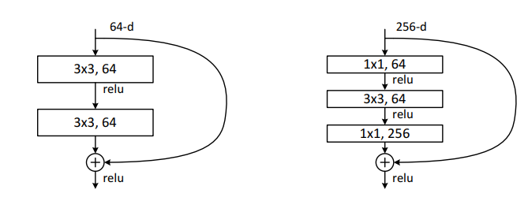

其中左图为BasicBlock的结构，右图为BottlNeck的结构。具体来说，两个组件都使用了ResNet中经典的shortcut结构，添加了输入到输出的直连边。

BasicBlock结构包含两个卷积层，输入经过两个卷积层后得到输出与输入相加，再经过激活函数然后输出到下一层。基本来说，如果该层的输入输出不涉及feature map维度的变化，那么所有层的维度都是一样的，如图中，都是64维。

BottleNeck结构包三个卷积层，第一个卷积层使用1\*1卷积核，目的是对输入进行降维。然后输入低纬度的卷积层进行特征提取，最后再使用1\*1的卷积核，目的是对输入进行升维，也就是维度的恢复。最后输出与输入相加，再经过激活函数然后输出到下一层。该层相当于先对图像降维处理，然后提取特征，然后再恢复为原来的维度。

这两个组件是ResNet特征提取层的组成部分。代码实现如下：

```python
class BasicBlock(nn.Module):
    def __init__(self, in_channels, out_channels, kernel_size, stride, downsample=False):
        super(BasicBlock, self).__init__()
        self.downsample = downsample
        self.seq = nn.Sequential(
            conv_bn_relu(in_channels, out_channels, kernel_size, stride),
            conv_bn_relu(out_channels, out_channels, kernel_size, stride=1, activation=False),
        )
        if self.downsample:
            self.downsampleLayer = nn.Sequential(
                nn.Conv2d(in_channels, out_channels, 1, 2, bias=False),
                nn.BatchNorm2d(out_channels),
            )
        self.activation = nn.ReLU()
    def forward(self, x):
        out = self.seq(x)
        if self.downsample:
            out += self.downsampleLayer(x)
        else:
            out += x
        return self.activation(out)
    
class BottleNeck(nn.Module):
    def __init__(self, in_channels, out_channels, mid_channels, kernel_size, stride, downsample=False, changeDim=False):
        super(BottleNeck, self).__init__()
        self.seq = nn.Sequential(
            conv_bn_relu(in_channels, mid_channels, 1, stride, 0),
            conv_bn_relu(mid_channels, mid_channels, kernel_size, 1),
            conv_bn_relu(mid_channels, out_channels, 1, 1, 0, activation=False),
        )
        xlayer_stride = 1
        if downsample:
            xlayer_stride = 2
        self.changeDim = changeDim
        if changeDim:
            self.xLayer = nn.Sequential(
                nn.Conv2d(in_channels, out_channels, 1, xlayer_stride, 0, bias=False),
                nn.BatchNorm2d(out_channels),
            )
        self.activation = nn.ReLU()
    def forward(self, x):
        out = self.seq(x)
        if self.changeDim:
            out += self.xLayer(x)
        else:
            out += x
        return self.activation(out)
```

* **ResNet模型实现**

原论文提供了5种ResNet模型，深度分别是18,34,50,101,152，同时还能延伸出很多其他层数的模型。若对这些模型一一编写代码，未免过于繁琐，因此考虑只实现一个ResNet类，至于网络的具体结构，则在\_\_init\_\_()中实现。模型实现代码如下：

```python
class ResNet(nn.Module):
    def __init__(self, layers, num_classes=10, components="BasicBlock"):
        super(ResNet, self).__init__()
        if components != "BasicBlock" and components != "BottleNeck":
            raise ValueError("components must be BasicBlock or BottleNeck")
        
        # conv1
        self.seq = nn.Sequential(
            conv_bn_relu(1, 64, 7, 2, 3),
        )
        
        # conv2_x
        self.seq.append(nn.MaxPool2d(3, 2, 1))
        if components == "BasicBlock":
            self.seq.append(BasicBlock(64, 64, 3, 1, downsample=False))
        else:
            self.seq.append(BottleNeck(64, 256, 64, 3, 1, False, True))
        for i in range(1, layers[0]):
            if components == "BasicBlock":
                self.seq.append(BasicBlock(64, 64, 3, 1))
            else:
                self.seq.append(BottleNeck(256, 256, 64, 3, 1))
        
        # conv3_x
        self.add_block(components, 64, 256, layers[1])
        
        # conv4_x
        self.add_block(components, 128, 512, layers[2])
                
        # conv5_x
        self.add_block(components, 256, 1024, layers[3])
                
        # avg pool and fc
        self.seq.append(nn.AvgPool2d(7))
        self.seq.append(nn.Flatten())
        input_dims = 512 if components == "BasicBlock" else 2048
        self.seq.append(nn.Linear(input_dims, num_classes))
        
    def forward(self, x):
        return self.seq(x)
    
    def add_block(self, components, basicblockDim, bottleneckDim, num):
        if components == "BasicBlock":
            self.seq.append(BasicBlock(basicblockDim, basicblockDim*2, 3, 2, downsample=True))
        else:
            self.seq.append(BottleNeck(bottleneckDim, bottleneckDim*2, bottleneckDim//2, 3, 2, True, True))
        for i in range(1, num):
            if components == "BasicBlock":
                self.seq.append(BasicBlock(basicblockDim*2, basicblockDim*2, 3, 1))
            else:
                self.seq.append(BottleNeck(bottleneckDim*2, bottleneckDim*2, bottleneckDim//2, 3, 1))
```

模型创建主要需要输入两个参数，layers和components，分别是卷积层层数的结构和使用的组件。\_\_int\_\_()函数根据这两个参数，构建对应的ResNet模型。

对于论文中给出的5中ResNet模型，则通过调用函数的方式得到：

```python
def ResNet18(num_classes=10):
    return ResNet([2, 2, 2, 2], num_classes)
def ResNet34(num_classes=10):
    return ResNet([3, 4, 6, 3], num_classes)
def ResNet50(num_classes=10):
    return ResNet([3, 4, 6, 3], num_classes, "BottleNeck")
def ResNet101(num_classes=10):
    return ResNet([3, 4, 23, 3], num_classes, "BottleNeck")
def ResNet152(num_classes=10):
    return ResNet([3, 8, 36, 3], num_classes, "BottleNeck")
```

至此，ResNet模型代码构建完成。

如今很多老师在介绍ResNet的时候都说ResNet是为了避免深层网络训练时梯度消失或梯度爆炸问题而出现的。但是ResNet出现的初衷并不是为了解决这些问题。深层网络训练时梯度消失或梯度爆炸问题可以通过标准化方法解决(BatchNorm, LayerNorm)。但是在实际使用深层网络模型的时候，何凯明和他的团队发现了如下问题：

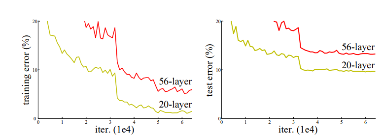

如图，56层的网络与20层的网络对比，网络深度显著增加了，但是模型的结果却是，20层的浅层网络结果更好。这是反直觉的，因为更深层的神经网络按理说可以模拟更复杂的隐含结构，而且理论上来说，将56层网络那额外的36层网络都变成恒等映射，照理说网络的表现应当和20层的相当，起码不应该更差。既然不是网络结构的“先天”问题，那就是优化的“后天”问题了。也就是说，**传统的深层网络很难优化到一个契合其网络深度的一个好的结果**。原论文中也并没有研究出造成该问题的原因，只是说会在后续进行研究，但论文中给出了一个猜想，即猜测训练网络的困难程度是网络层数的指数函数。也就是说**随着网络深度的增加，网络优化的难度会飙升**。对此我也有一些猜想，也许随着网络深度的增加，网络参数大幅增加，导致其解空间异常复杂，会有更多的局部最优点，而现如今的优化方法基本都是梯度下降法的一些变式，而梯度下降法本身就是极易陷入局部最优点的优化算法，因此难免导致深层网络的优化困难。

何凯明团队为解决深层网络的优化问题，提出了ResNet(残差网络)结构，其本质上就是使用了shortcut结构，通过引入输入和输出的直连边，使得每一块卷积结构训练目标值的残差而非目标值本身，这其实就是用到了之前对深层网络理论效果的思考，即将深层网络增加的层变为恒等映射，那么深层网络应当和浅层网络有相同的性能。直连边就相当于一个恒等映射，这样最差的情况，如果网络输出给出了全0输出，那么网络的性能也不会变得更差(较之浅层网络)。

## (4) VGG16

VGG16模型实现代码位于[VGG16.py](../codes/models/VGG16.py)，实现过程参考论文[[4]](https://arxiv.org/abs/1409.1556)中的以下图片：

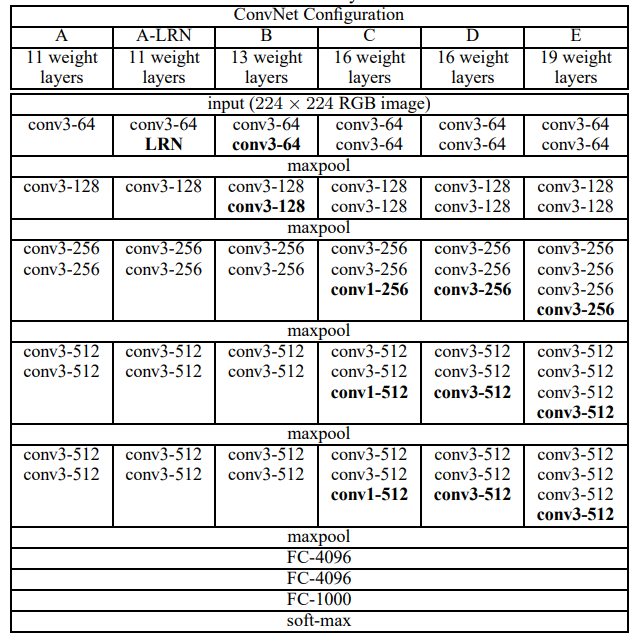

VGG网络也是非常有名的深层网络，有很多版本，本次项目使用了最经典的VGG-16模型，也就是上图的第5列，总共含16层网络，同时，较之AlexNet，VGG-16网络不管是卷积层的个数还是维度都更多，这得益于算力水平的提升，深层模型开始逐渐占据图像识别领域的主战场。并且可以发现，无论是LeNet还是AlexNet，都存在大卷积核。而VGG则只使用了3*3的卷积核，而使用增加卷积核维度来提升其性能，也就是说**使用更多的小卷积核代替了大卷积核**。

这样做可以在保证感受野的前提下，增加特征提取能力，因为非线性层增加了。同时，其参数也更少了，计算便知。在之后的深层网络模型中(如ResNet)都是用这一改动，因此近年来图像识别领域的卷积神经网络中很少能见到大卷积核。

在代码实现上，考虑到模型的灵活性，实现了VGG_block类，定义如下：

```python
class VGG_block(nn.Module):
    def __init__(self, conv_num, in_channels, out_channels):
        super(VGG_block, self).__init__()
        self.seq = nn.Sequential(
            nn.Conv2d(in_channels, out_channels, 3, 1, 1),
            nn.ReLU(inplace=True)
        )
        for i in range(1, conv_num):
            self.seq.append(nn.Conv2d(out_channels, out_channels, 3, 1, 1))
            self.seq.append(nn.ReLU(inplace=True))
        self.seq.append(nn.MaxPool2d(2, 2))
    def forward(self, x):
        return self.seq(x)
```

一个VGG_block即对应上图中一块连续的卷积核加上后面的一层最大池化层。

这样，VGG16模型就可以使用VGG_block作为卷积层组件来构建：

```python
class VGG16(nn.Module):
    def __init__(self, dropout_p=0.5, num_classes=10):
        super(VGG16, self).__init__()
        self.seq = nn.Sequential(
            VGG_block(2, 1, 64),
            VGG_block(2, 64, 128),
            VGG_block(3, 128, 256),
            VGG_block(3, 256, 512),
            VGG_block(3, 512, 512),
            
            nn.Flatten(),
            nn.Linear(512*7*7, 4096),
            nn.ReLU(inplace=True),
            nn.Dropout(dropout_p),
            nn.Linear(4096, 4096),
            nn.ReLU(inplace=True),
            nn.Dropout(dropout_p),
            nn.Linear(4096, num_classes),
        )
    def forward(self, x):
        return self.seq(x)
```

这样显著减少了模型代码量，也提升了后续编写其他VGG模型时的灵活性。

在我看来，VGG网络为人称道的有两点：

* 更深的网络结构。这得益于算力水平的显著提升，深层模型逐渐表现得更优。
* 多个小卷积核代替一个大卷积核。这样做的优点前面也有提到，增加了卷积层的特征提取能力，并减少了参数数量。

## (5) MobileNet

MobileNet模型实现代码位于[MobileNet.py](../codes/models/MobileNet.py)，实现过程参考论文[[5]](https://arxiv.org/abs/1801.04381)中的以下图片：

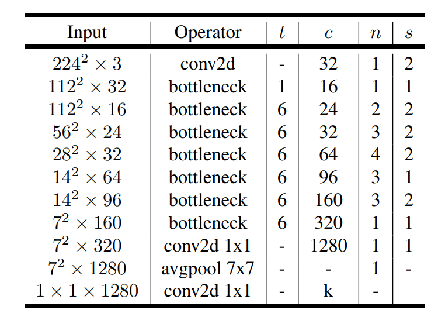

Mobile Net最初是2016-2017年谷歌提出的轻量级网络模型。其最早提出的**Mobile Net V1**主要的成果就是，**将VGG中的标准卷积换成深度可分离卷积[[6]](https://www.researchgate.net/publication/230867026_Simplifying_ConvNets_for_Fast_Learning)**。深度可分离卷积是2012年提出的用于解决普通卷积核计算效率低的问题提出的。简单来说，就是**将一个普通卷积核拆解为一个深度卷积和一个逐点卷积**。

深度卷积将卷积核拆分为单通道形式，对每一通道进行卷积操作，这样就得到了和输入通道数一致的输出feature map。逐点卷积则用于升维，因为单靠深度卷积的话，得到的feature map的维度实在是太低，若输入的图片通道数为3，那么后续所有的feature map的维度都是3了。具体结构如下图[[7]](https://zhuanlan.zhihu.com/p/70703846)所示：

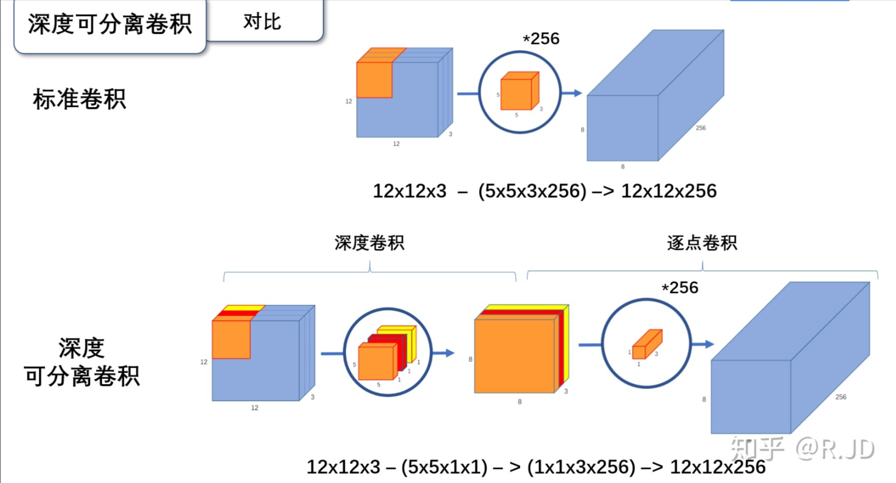

其参数量是普通卷积的$\frac{1}{D_WD_H}$。其计算量是普通卷积的$\frac{1}{N}+\frac{1}{D^2_K}$，其中$D_W,D_H,D_K$分别为feature map的宽、高以及卷积核的大小，$N$为输出维度。

作者将Mobile Net和GoogleNet、VGG16网络进行了比较：

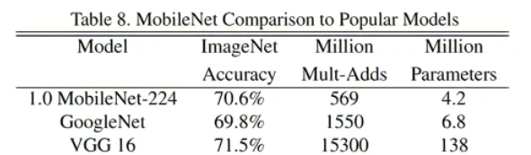

可以发现**Mobile Net的准确率和这两个经典的深层网络并没有多大的差别，但是参数量却有显著减少**。这就是轻量级模型的魅力。

但是Mobile Net V1存在不足，Mobile Net V2[[5]](https://arxiv.org/abs/1801.04381)(2017年)对其进行了解决。

一个问题是，训练结束后，深度卷积部分的卷积核有不少是空的。论文中认为这是激活函数ReLU的问题，具体涉及低维流形等数学概念，再次不深究。通俗来说就是，**对过低纬度的数据做ReLU运算，容易造成信息的丢失。而对高维数据做ReLU运算则信息丢失较少**。因此考虑将激活函数替换为线性激活函数。

另外一个问题就是，深度可分离卷积分为深度卷积核逐点卷积，深度卷积是作用于原输入上的，通道数等于输入通道，这就导致深度卷积只能在地位上工作。因此Mobile Net V2将深度卷积的输入数据先用1*1卷积进行升维，再进行深度卷积操作，再进行降维。

同时，由于Mobile Net V2是比较新的论文，因此采用了最新的研究成果ResNet的shortcut结构，通过添加直连边来提升优化能力。最终深度可分离卷积结构如图：

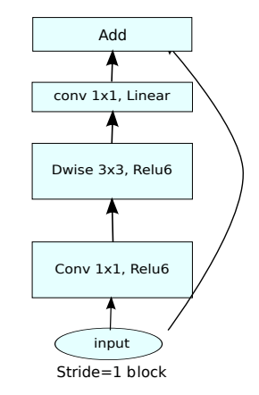

Mobile Net V2针对V1的优化主要就是这三点。其集成了Mobile Net V1和ResNet以及激活函数的一些改进，使得其是一个非常优秀的轻量级模型。

在代码实现上，由于原论文借鉴了ResNet的结构，因此代码实现也和ResNet类似。

首先**实现BottleNeck组件**，该组件的实现和上图一致，即在ResNet的BottleNeck基础上使用ReLU6激活函数，最后一个卷积用线性激活函数，中间的卷积使用深度卷积。全程先升维，然后做深度卷积(使用groups参数实现)，然后降维。代码如下：

```python
class MobileNetBottleNeck(nn.Module):
    def __init__(self, in_channels, out_channels, t, stride):
        super(MobileNetBottleNeck, self).__init__()
        expansion = in_channels * t
        
        self.seq = nn.Sequential(
            nn.Conv2d(in_channels, expansion, 1),
            nn.BatchNorm2d(expansion),
            nn.ReLU6(inplace=True),
            nn.Conv2d(expansion, expansion, 3, groups=expansion, stride=stride, padding=1),
            nn.BatchNorm2d(expansion),
            nn.ReLU6(inplace=True),
            nn.Conv2d(expansion, out_channels, 1),
            nn.BatchNorm2d(out_channels),
        )
        self.do_shortcut = False
        if stride == 1:
            self.do_shortcut = True
            if in_channels != out_channels:
                self.shortcut = nn.Sequential(
                    nn.Conv2d(in_channels, out_channels, 1),
                    nn.BatchNorm2d(out_channels),
                )
            else:
                self.shortcut = nn.Sequential()
    def forward(self, x):
        out = self.seq(x)
        if self.do_shortcut:
            out = out + self.shortcut(x)
        return out
```

然后**实现MobileNetV2**类。根据原论文，网络结构和ResNet50类似，模型结构在前面有图片，模型代码如下：

```python
class MobileNetV2(nn.Module):
    def __init__(self, num_classes=10):
        super(MobileNetV2, self).__init__()
        self.seq = nn.Sequential(
            nn.Conv2d(1, 32, 3, 2, 1),
            nn.BatchNorm2d(32),
        )
        self.add_bottleneck(1, 32, 16, 1, 1)
        self.add_bottleneck(6, 16, 24, 2, 2)
        self.add_bottleneck(6, 24, 32, 3, 2)
        self.add_bottleneck(6, 32, 64, 4, 2)
        self.add_bottleneck(6, 64, 96, 3, 1)
        self.add_bottleneck(6, 96, 160, 3, 2)
        self.add_bottleneck(6, 160, 320, 1, 1)
        self.seq.append(nn.Sequential(
            nn.Conv2d(320, 1280, 1, 1),
            nn.AvgPool2d(7),
            nn.Flatten(),
            nn.Linear(1280, num_classes),
        ))
    def add_bottleneck(self, t, in_channels, out_channels, n, stride):
        self.seq.append(MobileNetBottleNeck(in_channels, out_channels, t, stride))
        for i in range(n-1):
            self.seq.append(MobileNetBottleNeck(out_channels, out_channels, t, 1))
    def forward(self, x):
        return self.seq(x)
```

该模型总共53层卷积层(不算shortcut调整维度的1*1卷积)，之前实现的ResNet在实际跑的过程中使用的是ResNet34的版本，**因为更深的网络参数数量过多，而GPU内存又受限，只能减小batch_size，导致训练太慢了，而更浅的网络则无法体现ResNet训练深层网络的优势**。而Mobile Net使用深度可分离卷积替换了普通卷积层，使得更深层的网络的参数量大大减少，使得50多层的深层模型也可以跑得动。

# 4. 遇到的bug

本次项目中也遇到了很多问题。

## (1) 图片size的问题

上面提到的所有模型，除了LeNet模型是针对MNIST数据集的，其他模型就是用于ILSVRC比赛的ImageNet的分类问题，其输入是224×224，而本次项目的训练数据是28×28的。一开始这个问题让我很头疼。因为改变图片大小并不是reshape那么简单，涉及图片大小的放缩。我一开始考虑使用PIL库将所有图片数据都转换维度。但是后来报错内存不足，因为训练数据集加上测试数据集总共有70000\*224\*224个像素点。最后我使用torchvision中的transforms解决了这个问题。对于每个模型，确定一个pic_shape，然后利用pic_shape生成一个torch_resize，使用transforms.Resize(pic_shape)生成：

```python
torch_resize = transforms.Resize(pic_shape)
```

然后对于每个epoch，将x用torch_resize改变图片维度，也就是来一个batch改变一次维度，而不是一开始就将所有图片的size改变。这样会降低一些效率，但是能解决内存不足的问题。

## (2) ResNet输入维度对齐问题

ResNet使用了shortcut结构，从结构上来说似乎很简单，但是内层的卷积核很可能会提升维度，这就导致原本的输入和block的输出维度不匹配，这就需要用1*1的卷积核调整输入feature map维度。但是由于我实现ResNet使用了两个通用的BasicBlock和BottleNeck板块，而feature map维度改变只发生在某一个块的第一个block，具体见前面ResNet结构的图片。因此设置了一些flag来解决这个问题。

## (3) 显存不足

这是训练过程中遇到的最大的问题。本机的英伟达GPU可用显存为4G。

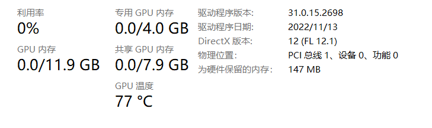

然而在训练时，无论我怎么减少batch_size，在检测验证集准确率时，总会报显存不足的错误。我很纳闷，因为训练是可以正常执行的，但是一到了验证阶段，显存使用就会突然飙升，然后产生了显存不足的问题。后来我发现是pytorch计算梯度的问题，验证时使用:

```python
with torch.no_grad():
    # codes...
```

即可避免这个问题，同时使用完的x和y数据及时del掉，显存问题就可以解决，可以根据GPU显存选择不同的batch_size。经过实验，各个模型适用的batch_size如下(4GB显存)：

```txt
LeNet:
    batch_size    512
AlexNet: 
    batch_size    128
ResNet:  
    batch_size    64
VGG: 
    batch_size    8
MobileNet:
	batch_size    32
```

这些信息在[main.py](../codes/main.py)中同样有。

## (4) VGG-16训练时间过长

这个问题几乎没有解决方法，没办法，VGG-16的参数量实在是太大了，即便能跑，batch_size只能设置为8，这导致模型训练得很慢，无奈，只能放弃。但是根据Mobile Net V2的论文，Mobile Net这一轻量级网络可以达到和VGG-16差不多的结果，但是参数量和计算量会少很多，因此可以一定程度上用Mobile Net的结果作为VGG-16的结果作参考。

# 5. 结果比对及分析

训练代码位于[train_test.py](../codes/utils/train_test.py)，由于主函数中设置了随机种子，因此使用相同的参数配置能得到相同的实验结果。通过调参使得在验证集上得到最好的结果，最后各个模型调参结果和训练测试结果如下：

## LeNet

**参数配置**

```txt
lr:          2e-4
reg:         0.0
batch_size:  512
epoch:       100
optimizer:   Adam
```

**训练以及测试结果**

```txt
Loading data...
train size:  torch.Size([54000, 1, 28, 28])
valid size:  torch.Size([6000, 1, 28, 28])
test size:  torch.Size([10000, 1, 28, 28])

Training...
Model: LeNet
Epoch10 loss 2.812075 valid accuracy 93.433334% time cost 0.0222min
Epoch20 loss 2.094417 valid accuracy 94.950005% time cost 0.0225min
Epoch30 loss 1.762389 valid accuracy 95.566666% time cost 0.0222min
Epoch40 loss 1.587865 valid accuracy 96.183334% time cost 0.0214min
Epoch50 loss 1.493118 valid accuracy 96.016670% time cost 0.0217min
Epoch60 loss 1.441894 valid accuracy 96.400002% time cost 0.0223min
Epoch70 loss 1.392656 valid accuracy 96.566666% time cost 0.0220min
Epoch80 loss 1.434792 valid accuracy 96.533333% time cost 0.0231min
Epoch90 loss 1.458327 valid accuracy 96.416664% time cost 0.0242min
Epoch100 loss 1.441855 valid accuracy 96.450005% time cost 0.0207min
Testing...
Test loss 1.960664 acc 97.0200%
```

**训练过程**

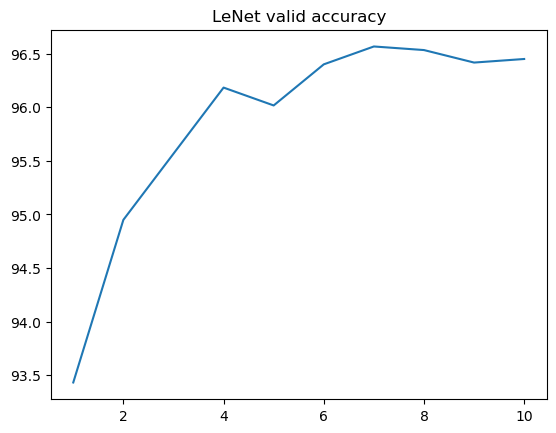

## AlexNet

**参数配置**

```txt
lr:          1e-5
reg:         0.0
dropout:     0.5
batch_size:  128
epoch:       10
optimizer:   Adam
```

**训练以及测试结果**

```txt
Loading data...
train size:  torch.Size([54000, 1, 28, 28])
valid size:  torch.Size([6000, 1, 28, 28])
test size:  torch.Size([10000, 1, 28, 28])

Training...
Model: AlexNet
Epoch1 loss 3.954735 valid accuracy 97.550036% time cost 3.3726min
Epoch2 loss 2.731162 valid accuracy 98.400070% time cost 3.3731min
Epoch3 loss 2.297861 valid accuracy 98.700034% time cost 3.3796min
Epoch4 loss 2.132724 valid accuracy 98.766670% time cost 3.3756min
Epoch5 loss 2.054022 valid accuracy 98.849998% time cost 3.3742min
Epoch6 loss 2.023577 valid accuracy 98.833336% time cost 3.3764min
Epoch7 loss 2.094453 valid accuracy 98.816666% time cost 3.3771min
Epoch8 loss 1.616047 valid accuracy 99.083336% time cost 3.3796min
Epoch9 loss 1.564418 valid accuracy 99.183334% time cost 3.3811min
Epoch10 loss 1.592178 valid accuracy 99.083336% time cost 3.3803min
Testing...
Test loss 1.193114 acc 99.4500%
```

**训练过程**

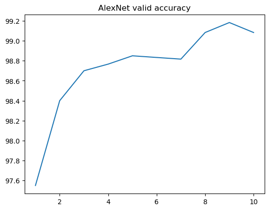

## ResNet34

**参数配置**

```txt
lr:          1e-5
reg:         0.0
batch_size:  64
epoch:       10
optimizer:   Adam
```

**训练以及测试结果**

```txt
Loading data...
train size:  torch.Size([54000, 1, 28, 28])
valid size:  torch.Size([6000, 1, 28, 28])
test size:  torch.Size([10000, 1, 28, 28])

Training...
Model: ResNet
Epoch1 loss 5.250936 valid accuracy 98.416672% time cost 12.6120min
Epoch2 loss 4.542497 valid accuracy 98.633331% time cost 12.5769min
Epoch3 loss 3.009797 valid accuracy 99.083336% time cost 12.5772min
Epoch4 loss 4.560968 valid accuracy 98.699997% time cost 12.5892min
Epoch5 loss 3.092700 valid accuracy 99.083336% time cost 12.5926min
Epoch6 loss 3.738620 valid accuracy 98.933334% time cost 12.5889min
Epoch7 loss 3.303576 valid accuracy 99.000000% time cost 12.5866min
Epoch8 loss 3.749094 valid accuracy 98.949997% time cost 12.5887min
Epoch9 loss 2.928174 valid accuracy 99.233337% time cost 12.5869min
Epoch10 loss 2.737240 valid accuracy 99.266663% time cost 12.5789min
Testing...
Test loss 3.681234 acc 99.2600%
```

**训练过程**

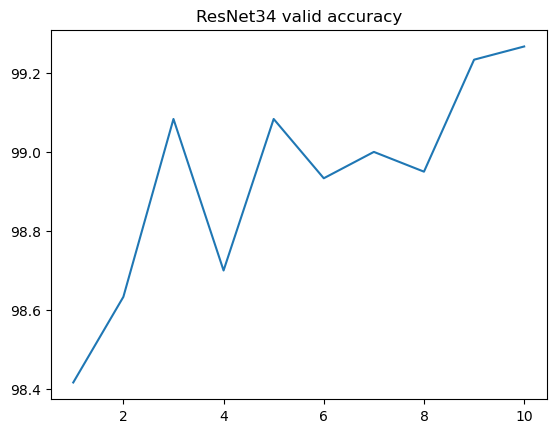

## MobileNet V2

**参数配置**

```txt
lr:          2e-4
reg:         0.0
batch_size:  32
epoch:       10
optimizer:   Adam
```

**训练以及测试结果**

```txt
Loading data...
train size:  torch.Size([54000, 1, 28, 28])
valid size:  torch.Size([6000, 1, 28, 28])
test size:  torch.Size([10000, 1, 28, 28])

Training...
Model: MobileNet
Epoch1 loss 14.292914 valid accuracy 97.549995% time cost 6.7527min
Epoch2 loss 11.036870 valid accuracy 98.266670% time cost 6.6690min
Epoch3 loss 9.682508 valid accuracy 98.566666% time cost 6.6758min
Epoch4 loss 8.163336 valid accuracy 98.900002% time cost 6.6690min
Epoch5 loss 8.534497 valid accuracy 98.516670% time cost 6.6810min
Epoch6 loss 7.186409 valid accuracy 98.949997% time cost 6.6714min
Epoch7 loss 9.242710 valid accuracy 98.699997% time cost 6.6811min
Epoch8 loss 5.153101 valid accuracy 99.250000% time cost 6.6722min
Epoch9 loss 5.901115 valid accuracy 99.166664% time cost 6.6810min
Epoch10 loss 7.013510 valid accuracy 98.983337% time cost 6.6688min
Testing...
Test loss 7.856747 acc 99.0900%
```

**训练过程**

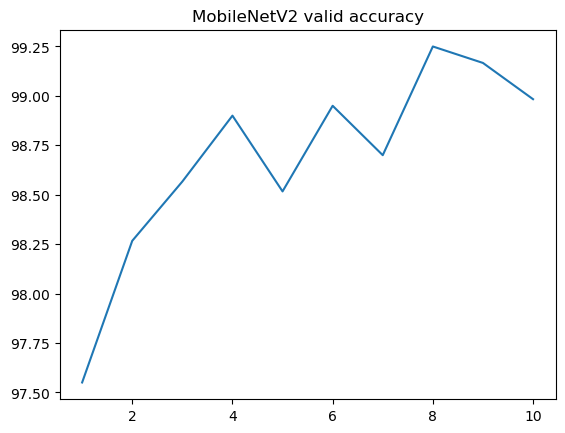

## 四个模型在验证集的准确率横向对比

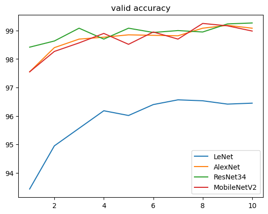

## 四个模型在测试集结果比较

|     模型     | 验证集最终准确率 | 测试集最终准确率 |
| :----------: | :--------------: | :--------------: |
|    LeNet     |     96.4500%     |     97.0200%     |
|   AlexNet    |     99.0833%     |     99.4500%     |
|   ResNet34   |     99.2667%     |     99.2600%     |
| MobileNet V2 |     98.9833%     |     99.0900%     |

## 总结分析

通过四个模型训练和结果的分析，可以得到以下结论：

### (1) 运行时间分析

各个模型单个epoch大致的运行时间如下(主函数中也有注释信息): 

``` txt
recommended arguments(recommended only, according to GPU mem):
    LeNet:                 0.02 min/epoch
        batch_size    512
    AlexNet:               3 min/epoch
        batch_size    128
    ResNet:                12.8 min/epoch
        batch_size    64
    VGG-16:                VERYLARGE min/epoch
        batch_size    8
    MobileNetV2:           6.6 min/epoch
        batch_size    32
```

可以发现，LeNet模型单个epoch的运行时间明显少于其他模型，因为该模型的参数数量明显少。但是更让我感兴趣的是ResNet和MobileNetV2的对比。前面提到过，MobileNetV2是2017年的成果，因此其网络实现使用了当时最优的网络ResNet，原论文中使用的是ResNet50，因此MobileNetV2的深度是远大于ResNet34的，整整多了16层。但是由于MobileNetV2使用的是深度可分离卷积，因此减少了计算量，使得其即使模型层数更深，最后单个epoch的时间也仅仅是ResNet34的一半。而且看两者最终准确率其实差别并不大。轻量级模型的优势在此体现出来了。

### (2) 验证集准确率变化分析

可以发现，随着epoch的增加，LeNet和AlexNet的验证机准确率都是递增的，相对平滑，但是ResNet和MobileNet就相对更加波折。MobileNet相当于轻量级的ResNet50。在我看来，造成这个差异的并不是直连边shortcut结构，而是由于后两者的网络更深，导致训练集到验证集的泛化难度更大，这才导致了验证集优化的波动。但是训练集的优化一定是平滑的。

### (3) 最终结果比较分析

可以发现四个模型的结果，LeNet的结果准确率并不高，其余模型的结果准确率都相差不多，都能达到99%以上的测试集准确率。

上面的四个模型粗浅来说可以分成两种模型：浅层模型和深层模型。LeNet是最简单朴素的一个CNN模型，其训练效率是最快的，但是结果也是最差的。而后面三个都是深层网络大模型，AlexNet大在卷积核的维度，而ResNet34和MobileNetV2则大在网络的深度(34层和50层)。并且后面三个模型最初都是为224*224的三通道图片的1000分类任务准备的(起码论文中是如此)，如今用在28\*28单通道图片的10分类任务上，难免有些"大材小用"，因此可以发现模型收敛得很快，基本上在第一个epoch过后的验证集准确率就超过了LeNet，并且模型的泛化能力也很强。其实这三个模型还可以表现得更好，如果增加epoch的话。但是训练时间实在是过长，像VGG-16我直接放弃了训练，因为其参数过多，一个是计算量过大，另一个是GPU显存有限，参数过多的话，数据的batch_size就不能过大，导致训练缓慢。

因此，这个MNIST图像分类任务对后三者来说过于简单了。但是却**可以通过结果看出ResNet和MobileNetV2的优势**。在ResNet的论文[[3]](https://arxiv.org/abs/1512.03385)中作者提到了：**更深层的网络优化会更困难，导致深层网络的表现能力不如浅层网络。**这里的优化困难不是因为梯度爆炸和梯度消失的问题，这些问题可以用标准化层解决。这里的优化困难指的是模型本身带来的一种特性，前面也提到过。但是ResNet受恒等变换启发，通过增加shortcut结构，使得深层网络的优化更加容易，深层网络的优势也体现了出来。而MobileNetV2更是站在了巨人的肩膀上，将MobileNetV1的深度可分离卷积用在了ResNet上，得到了与之相差不多的结果，但是计算量和参数量大幅减少。

# 6. 代码运行

代码运行脚本可参照[run.sh](../run.sh)：

```shell
python codes/main.py --model LeNet --lr 2e-4 --batch_size 512 --optimizer Adam --device cuda --epoch 100
```

在run.sh同级目录下运行脚本即可复现上面LeNet的实验结果，如图：

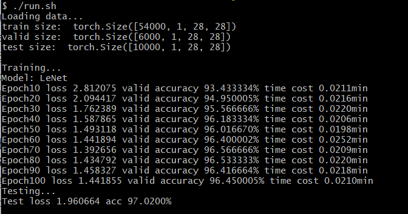

除了上述参数外，还有其他可选参数：

* reg: 正则项系数
* dropout: dropout概率，只在两个线性层多的网络有用：AlexNet、VGG-16

另外，可选的--model有：LeNet, AlexNet, ResNet, VGG, MobileNet.

# 7. 参考文献

[[1] Gradient-based Learning Applied To Document Recognition - Proceedings of the IEEE (byu.edu)](https://axon.cs.byu.edu/~martinez/classes/678/Papers/Convolution_nets.pdf)

[[2] ImageNet Classification with Deep Convolutional Neural Networks](https://proceedings.neurips.cc/paper_files/paper/2012/file/c399862d3b9d6b76c8436e924a68c45b-Paper.pdf)

[[3] Deep Residual Learning for Image Recognition (arxiv.org)](https://arxiv.org/abs/1512.03385)

[[4] Very Deep Convolutional Networks for Large-Scale Image Recognition (arxiv.org)](https://arxiv.org/abs/1409.1556)

[[5] MobileNetV2: Inverted Residuals and Linear Bottlenecks (arxiv.org)](https://arxiv.org/abs/1801.04381)

[[6] Simplifying ConvNets for Fast Learning (researchgate.net)](https://www.researchgate.net/publication/230867026_Simplifying_ConvNets_for_Fast_Learning)

[[7]轻量级神经网络“巡礼”（二）—— MobileNet，从V1到V3 - 知乎 (zhihu.com)](https://zhuanlan.zhihu.com/p/70703846)